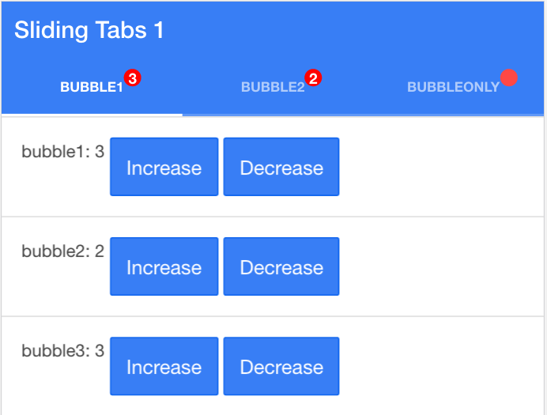

angular-red-bubble
----

Description
----

Angular Integration of red bubbles which could be attached to html elements, like tab bar of Wechat

ScreenShot
----

Source
----

    src/angular-red-bubble.js
    src/angular-red-bubble.css
    
Usage
----
    1. Import them to your html
        <!-- html -->
        <!-- ... other css files -->
        
        <link href="your/path/to/angular-red-bubble.css" rel="stylesheet">
        
        <!-- ... other js files and ionic.bundle.js or angular.js -->
        
        
    
    
    
    2. Add module dependencies- 
       	// js
       	angular.module('YourApp', ['redBubble'])
    
    3.Bind directive to your elements, bubble_id is a must.
    
        <!-- html -->
        <!-- Give each bubble a id, then you'll be able to modify its count*er by RedBubbleFactory -->
        
I have a red bubble!

        
        <!*-- If bubble-only=* true' then the bubble will only show a bubble when counter > 0, and hide when counter==0 -->
        
    4. Inject RedBubbleFactory, then use it to set counter of your bubbles
        
        // js
        RedBubbleFactory.bubble("bubble_id").increase();
        RedBubbleFactory.bubble("bubble_id").decrease();
        RedBubbleFactory.bubble("bubble_id").set_counter(10);
        RedBubbleFactory.set_bubble("another_id", 20);
