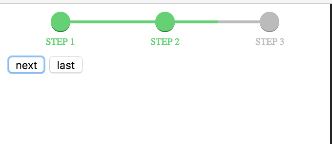

angular-step-process
----

Dependency
----
[CSS Progress Wizard](https://github.com/christabor/css-progress-wizard)


Description
----
This component is an angular wrap to [CSS Progress Wizard](https://github.com/christabor/css-progress-wizard), which is written in pure css.


Demo
----


More demo can be found on [the css demo page](http://christabor.github.io/css-progress-wizard/)


Source
----

    src/angular-angular-step-progress.js
    
Usage
----
1.Add the css dependency and the js to your html<br>

```
    <!-- html -->
    <!-- ... other css files -->
    
    <link href="your/path/to/progress-wizard.min.css" rel="stylesheet">
    
    <!-- ... other js files and angular.js -->
    
    <script src="your/path/to/angular-step-progress.js"></script>
```

2.Add module dependencies

```
    // js
    angular.module('YourApp', ['stepProgress')
```

3.Bind directive to your elements

```
    <!-- html -->
    <step-list class="bar bar-subheader" current-step="ctrl.current_step_id">
        <step-item step-id="0" name="{{'Step 1'|translate}}"></step-item>
        <step-item step-id="1" name="{{'Step 2'|translate}}"></step-item>
        <step-item step-id="2" name="{{'Step 3'|translate}}"></step-item>
    </step-list>
```

Use `current-step` in `step-list` to tell which step you are on.

Feel free to custom styles.